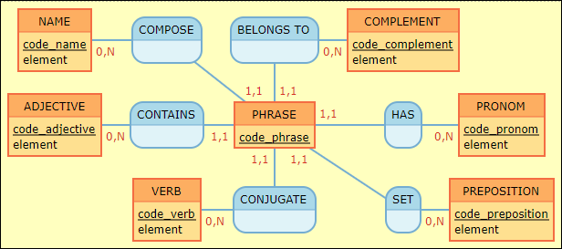
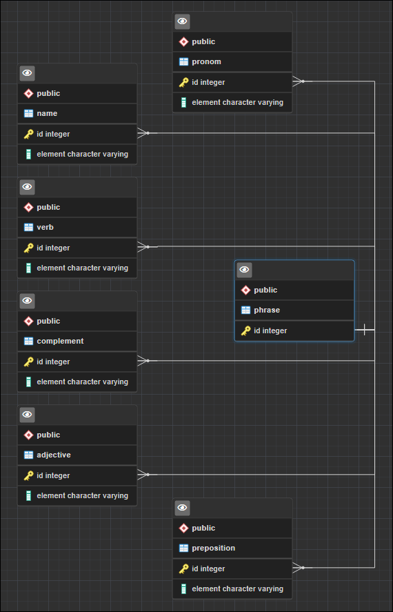

# Cadavre exquis

## Concept du jeu

Le cadavre exquis est un jeu graphique ou d'écriture collectif inventé par les surréalistes, en particulier Jacques Prévert et Yves Tanguy, vers 1925.

Le jeu consiste à faire composer une phrase par plusieurs personnes sans qu'aucune d'elles puisse tenir compte des mots précédents.

L'ordre syntaxique est importante pour que la phrase soit grammaticalement correcte.

Pour en savoir plus, c'est par là => [here](https://fr.wikipedia.org/wiki/Cadavre_exquis)

## Concept de l'application

### Mise en place des éléments : MCD

Pour la mise en place des éléments,nous avons déterminé les associations qui existent entre les différentes entités avec leurs attributs respectifs identifées chacunes par un code unique.

La réalisation du modèle conceptuel a été fait sur [Mocodo](http://mocodo.wingi.net/) et voici le schéma :



Et ci-dessous la version écrite :

```
NAME: code_name, element
COMPOSE, 0N NAME, 11 PHRASE
BELONGS TO, 0N COMPLEMENT, 11 PHRASE
COMPLEMENT: code_complement, element
:

PRONOM: code_pronom, element
HAS, 0N PRONOM, 11 PHRASE
PHRASE: code_phrase
CONJUGATE, 0N VERB, 11 PHRASE
VERB: code_verb, element

ADJECTIVE: code_adjective, element
CONTAINS, 0N ADJECTIVE, 11 PHRASE
SET, 0N PREPOSITION, 11 PHRASE
PREPOSITION: code_preposition, element
:
```

On distingue donc les entités suivantes :

- Name
- Verb
- Complement
- Adjective
- Preposition
- Pronom

Et chacune des entités sont associées à l'entité phrase que l'on complètera.

### Définition du MLD

Pour le modèle logique de données, nous allons retrouver les différentes tables :

```
NAME ( name_id, element )
COMPLEMENT ( complement_id, element )
ADJECTIVE ( adjective, element )
PHRASE ( phrase_id, #preposition_id, #complement_id, #adjective_id, #name_id, #verb_id, #pronom_id )
PRONOM ( pronom_id, element )
VERB ( verb_id, element )
PREPOSITION ( preposition_id, element )
```

### Définition du MPD

Et voici le modèle physique de données pour l'établissement des différentes tables :



## Partie Back : création de l'API

## Partie Front : récupération et affichage des données

## Déploiement
