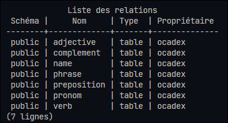
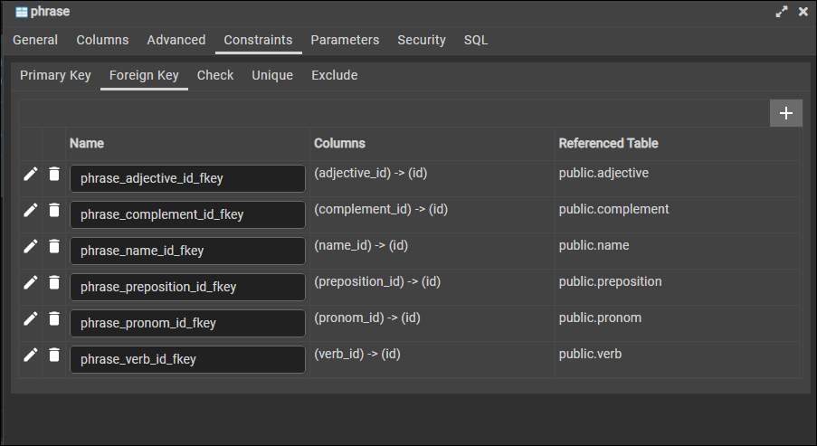
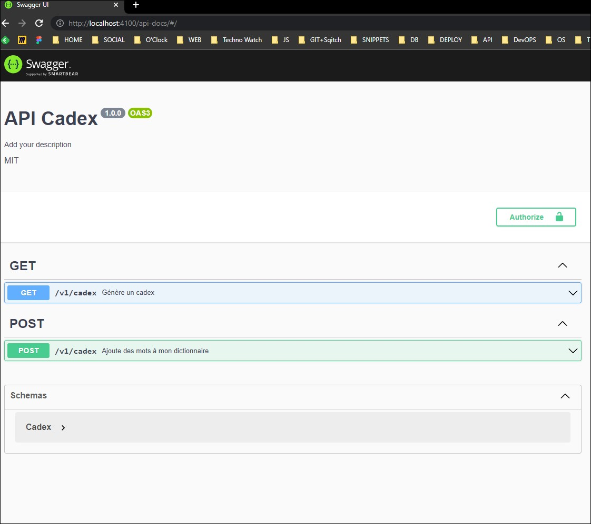
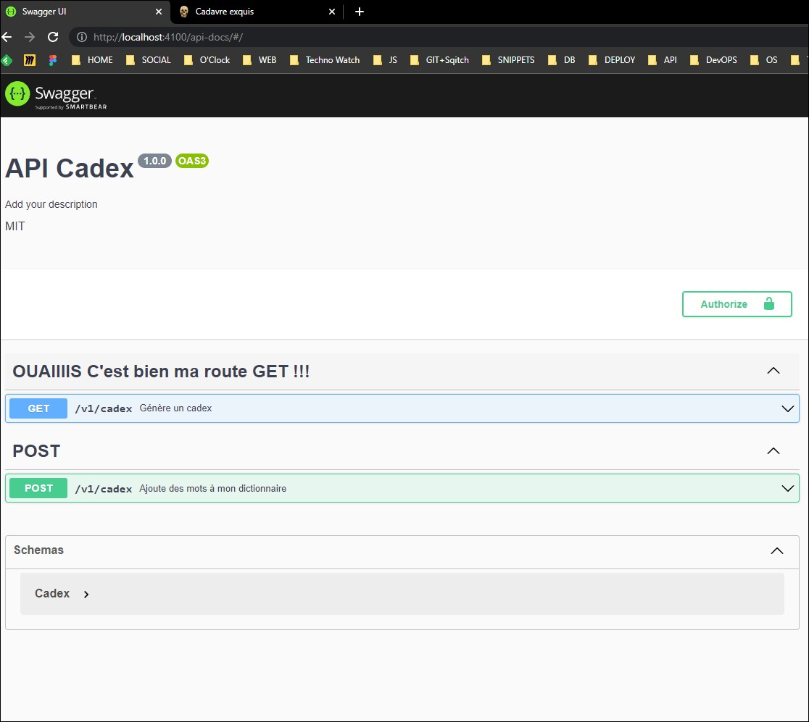
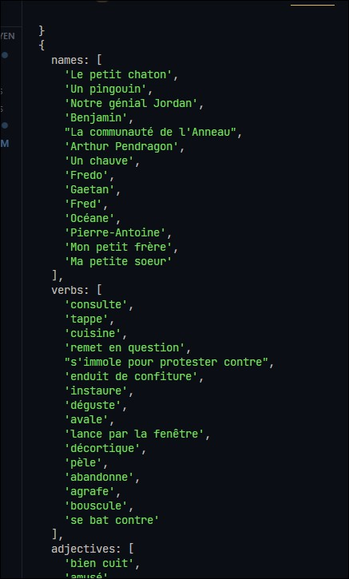
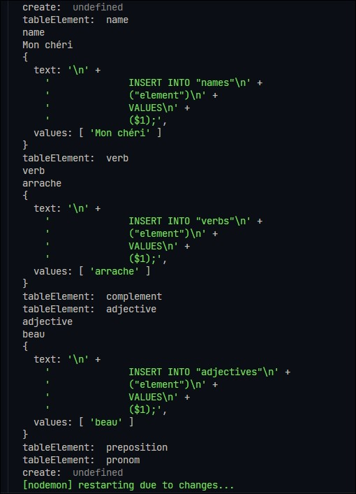

# Cadavre exquis

## Concept du jeu 🎰

Le cadavre exquis est un jeu graphique ou d'écriture collectif inventé par les surréalistes, en particulier Jacques Prévert et Yves Tanguy, vers 1925.

Le jeu consiste à faire composer une phrase par plusieurs personnes sans qu'aucune d'elles puisse tenir compte des mots précédents.

L'ordre syntaxique est importante pour que la phrase soit grammaticalement correcte.

Pour en savoir plus, c'est par là => [here](https://fr.wikipedia.org/wiki/Cadavre_exquis)

## Concept de l'application 🎱

Nous avons choisi de partir sur une phrase composée des différents éléments et qui n'existent que dans le cas où les éléments sont présents.

### Mise en place des éléments : MCD

<details>
<summary>Détails</summary>
<br>
Pour la mise en place des éléments, nous avons déterminé les associations qui existent entre les différentes entités avec leurs attributs respectifs déterminées chacunes par un code unique.

La réalisation du modèle conceptuel a été fait sur [Mocodo](http://mocodo.wingi.net/) et voici le schéma :


Et ci-dessous la version écrite :

```
NAME: code_name, element
COMPOSE, 0N NAME, 11 PHRASE
BELONGS TO, 0N COMPLEMENT, 11 PHRASE
COMPLEMENT: code_complement, element
:

PRONOM: code_pronom, element
HAS, 0N PRONOM, 11 PHRASE
PHRASE: code_phrase
CONJUGATE, 0N VERB, 11 PHRASE
VERB: code_verb, element

ADJECTIVE: code_adjective, element
CONTAINS, 0N ADJECTIVE, 11 PHRASE
SET, 0N PREPOSITION, 11 PHRASE
PREPOSITION: code_preposition, element
:
```

On distingue donc les entités suivantes :

- Name
- Verb
- Complement
- Adjective
- Preposition
- Pronom

Et chacune des entités sont associées à l'entité phrase que l'on complètera.
</details>

### Définition du MLD

<details>
<summary>Détails</summary>
<br>
Pour le modèle logique de données, nous allons retrouver les différentes tables :

```
NAME ( name_id, element )
COMPLEMENT ( complement_id, element )
ADJECTIVE ( adjective, element )
PHRASE ( phrase_id, #preposition_id, #complement_id, #adjective_id, #name_id, #verb_id, #pronom_id )
PRONOM ( pronom_id, element )
VERB ( verb_id, element )
PREPOSITION ( preposition_id, element )
```

</details>

### Définition du MPD

<details>
<summary>Détails</summary>
<br>

Et voici le modèle physique de données pour l'établissement des différentes tables :


</details>

### Création de la base de données

<details>
<summary>Détails</summary>
<br>

Etablissement du fichier sql pour la création de la base de données [ici](./data/01_create_db.sql)



On peut retrouver les contraintes liées à la phrase sur [pgAdmin](https://www.pgadmin.org/) pour la visualisation sur une interface graphique

Voilà un exemple !



</details>

### Insertion des données en utilisant Javascript

<details>
<summary>Détails</summary>
<br>

On cherche à importer les données d'un fichier JSON dans la base de données qu'on a créé au préalable.

Les étapes d'insertion sont les suivantes :

- Import du fichier json

- Configurer les variables d'environnement dans le fichier .env

- Se connecter à la base de données

- Créer une requête pour insérer les données

```js
//~import modules
import data from './parts.json' assert {type: 'json'};
// import dotenv from 'dotenv';
// dotenv.config();
import 'dotenv/config';

import pg from 'pg';
const client = new pg.Client();

async function insertData(){
    //#open channel
    await client.connect();
    
    for (const tableName in data) {
    //for await for waiting a Promise
        for await (const value of data[tableName]) {

            // client.query("INSERT INTO table_name (label) VALUES ($1)", [value]);
            const query = {
                text: `
                INSERT INTO "${tableName}"
                ("element")
                VALUES
                ($1);`,
                values: [value]
            };
            //await must be put here
           await client.query(query);
        }
    }

    //#close channel
    await client.end();
};

insertData();
```

=> Configuration du fichier .env pour connecter à la DB

```
#INFO CONNEXION DB PSQL
PGHOST=localhost
PGDATABASE=#
PGUSER=#
PGPASSWORD=#
PGPORT=5432
```

</details>

## Partie Back : création de l'API 🔙🔚

### Mise en place du package Joi

<details>
<summary>Détails</summary>
<br>

Télécharger le module Joi

```sh
npm i joi
```

Mettre en place le schéma pour définir ce qu'on veut récupérer du body

```js
import joi from 'joi';
const Joi  = joi;


const schema = Joi.object({
    name:Joi.string(), //name must be a string
    verb:Joi.string(),
    complement:Joi.string(),
    adjective:Joi.string(),
    preposition:Joi.string(),
    pronom:Joi.string()
}).required().min(1).max(6);
// min et max indique le nombre de clefs minimum et maximum de l'objet

export {schema};
```

Dans le router, on va créer des middlewares pour contrôler l'arrivée des informations venant du body.

Sur la route POST, on mettra en argument le schema qu'il faut au préalable importer.

```js
//~Import modules
import { Router } from 'express';
const router = Router();

import { fetchAllCadex, doRandomCadex } from './controllers/mainController.js';
import { validationService } from './service/validation.js';
import { schema } from './schema/cadex.schema.js';

//~Routes
/*mw validation to check if the body returns the correct response*/
router.get('/v1/cadex', validationService.request, fetchAllCadex);
router.post('/v1/cadex', validationService.body(schema), doRandomCadex);

export { router };

```

On va ensuite construire nos méthodes pour valider les éléments

```js
import { schema } from '../schema/cadex.schema.js';

const validationService = {
    body(schemaCustom) {
        //valid req.body format
        return function(req, res, next){

            const { error } = schemaCustom.validate(req.body);
            if (error) { // is any error here ?
                // if yes, error
                return;
            }

            next();
        };
    },
    request(req, res, next) {
        // je valide ma req.query avec Joi
        const { error } = schema.validate(req.query);

        if (error) {
            // j'indique qu'il y a une erreur
            return;
        }

        next();
    }
};

export { validationService };
```

Pour la méthode body, on met bien en paramètre le schéma qu'on récupèrera. S'il y a une erreur, on s'arrête là, rien ne s'affichera.

Par contre, si les éléments passent, grâce au `next()` on passera bien à la fonction suivante (on poursuit notre 'route' :p ! )

</details>

### Mise en place de JSDocs grâce à Swagger

<details>
<summary>Détails</summary>
<br>

## Installation

```sh
npm i express-jsdoc-swagger 
```

Swagger va générer de la documention à partir des commentaires qu'on va faire tout au long de notre code

## Specificité en ES Module

Pour accéder au  `__dirname` on va devoir le récupérer :

```js
//! For ESMODULE, to get __dirname
//source : https://bobbyhadz.com/blog/javascript-dirname-is-not-defined-in-es-module-scope#:~:text=The%20__dirname%20or%20__,directory%20name%20of%20the%20path.

import path from 'path';
import {fileURLToPath} from 'url';

const __filename = fileURLToPath(import.meta.url);
const __dirname = path.dirname(__filename);
```

Pour mettre en place Swagger, on doit configurer les options dans notre point d'entrée index.js

```js
//~SWAGGER
import expressJSDocSwagger from 'express-jsdoc-swagger';

const options = {
  info: {
      version: "1.0.0",
      title: "API Cadex",
      license: {
          name: "MIT",
      },
  },
  security: {
      BasicAuth: {
          type: "http",
          scheme: "basic",
      },
  },
  swaggerUIPath: "/api-docs" ,
  baseDir: __dirname,
  // Glob pattern to find your jsdoc files (multiple patterns can be added in an array)
  filesPattern: "./**/*.js",
};

expressJSDocSwagger(app)(options);
```

Exemple pour l'écriture de la documentation

```js
//~Import modules
import { Router } from 'express';
const router = Router();

import { fetchAllCadex, doRandomCadex } from './controllers/mainController.js';
import { validationService } from './service/validation.js';
import { schema } from './schema/cadex.schema.js';

/**
 * The Cadex is the name for 'Cadavre Exquis' in France, we put random words to make a sentence
 * @typedef {*} Cadex
 * @property {string} name
 * @property {string} verb
 * @property {string} complement
 * @property {string} adjective
 * @property {string} preposition
 * @property {string} pronom
 */

//~Routes
/*mw validation to check if the body returns the correct response*/

/**
 * GET /v1/cadex
 * @summary Génère un cadex
 * @tags GET
 * @return {Cadex} 200 - success response - application/json
 */
router.get('/v1/cadex', validationService.request, fetchAllCadex);
/**
 * POST /v1/cadex
 * @summary Ajoute des mots à mon dictionnaire
 * @tags POST
 * @return {} 200 - success response - application/json
 */
router.post('/v1/cadex', validationService.body(schema), doRandomCadex);

export { router };

```

Pour atteindre notre doc :

ajouter `/api-docs`

Avec JSDOCS on peut grouper nos routes avec le tag

```js
@tags GET

ou 

@tags POST
```

Et Tadaaaaam



### Et un petit custom pour tester mon tag



</details>

## Utilisation de la base de données

### Branche `DB` => permet de voir les requêtes

<details>
<summary>Détails</summary>
<br>

### Modification des noms de tables

Pour garder les nommages déjà utilisés, j'ai mis à jour le nom des tables en base de données

```sql
BEGIN;

ALTER TABLE "name" RENAME TO "names";
ALTER TABLE "verb" RENAME TO "verbs";
ALTER TABLE "complement" RENAME TO "complements";
ALTER TABLE "adjective" RENAME TO "adjectives";
ALTER TABLE "preposition" RENAME TO "prepositions";
ALTER TABLE "pronom" RENAME TO "pronoms";

COMMIT;
```

### Mise en place de la connection avec DB

La connection avec la base de données se fera par le biais du module `pg`

```js
//~import pg module
//module pg for CommonJs, need to import by default first
import pg from 'pg';

//~create new client
const client = new pg.Client();

//~connect client
client.connect();

//~export client
export { client };
```

Il faudra également bien vérifier les informations renseignées dans notre fichier `.env`

### Récupération des données

Pour la récupération des données à la base de données, on va essayer de garder la structure du fichier JSON : un objet qui contient chaque élément sous une structure key:value.

Pour cela, j'ai choisi de partir sur une boucle me permettant de récupérer chaque table et leurs valeurs respectives :

```js
//~import modules
import { client } from '../database.js';
//destructured array
const TABLE_NAME = ['names', 'verbs', 'complements', 'adjectives', 'prepositions', 'pronoms'];

//~datamapper
/**
 * 
 * @returns all data from DB where each key is table and value their own values
 */
async function findAll() {
  const data = {};

  for (let index = 0; index < TABLE_NAME.length; index++) {
    const element = TABLE_NAME[index];

    const query = {
      text: `
        SELECT 
        JSON_AGG("${element}".element) as "${element}" 
        FROM ${element};`
    };

    const result = await client.query(query);

    data[element] = result.rows[0][element];
  }

  return data;
}

export { findAll };

```
La requête utilisée est une fonction d'aggrégation qui me permet ici de ne générer qu'une cellule de données avec à l'intérieur un JSON avec toutes les données.

On récupère bien les données voulues



Et cela nous permet de garder la structure déjà existante.

### Création des données

Pour la création des données, on a donc la fonction suivante

```js
async function createData(dataElement) {
  for (let index = 0; index < TABLE_NAME.length; index++) {
    const element = TABLE_NAME[index];
    //giving 'name' in singular
    const tableElement = element.slice(0, -1);
    const bodyElementValue = dataElement[tableElement];

    if (bodyElementValue !== undefined) {
      for (const [key, value] of Object.entries(dataElement)) {
        if (key === tableElement) {
          const query = {
            text: `
              INSERT INTO "${element}"
              ("element")
              VALUES
              ($1);`,
            values: [value]
          };

          await client.query(query);
          //if return, created only one entry
        }
      }
    }
  }
}
```

En fonction du nombre de tables, je récupère l'intitulé et j'effectue ma boucle qui me permet de comparer ce que je récupère du body pour envoyer seulement ce dont j'ai besoin.

=> TESTS

L'insertion des données se font correctement.

Ici, je ne gère volontairement pas si l'élément est déjà



</details>

## Partie Front : récupération et affichage des données 🎨

## Déploiement ♓

Déploiement fait sur Heroku : <https://cadex-app.herokuapp.com/>
